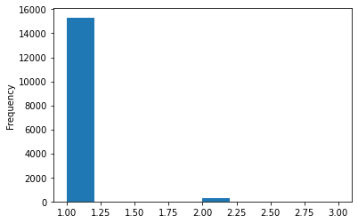

# 1. 项目背景&要求

## 1.1 项目背景解读
> 本项目基于阿里天池大赛：

商家有时会在特定日期，例如boxing-day，黑色星期五或是双十一（11月11日）开展大型册小活动或者发放优惠券以吸引消费者，然而很多被吸引来的买家都是一次性消费者，这些促销活动可能对销售业绩的增长并没有长远帮助，因此为解决这个问题，商家需要识别出哪类消费者可以转化未重复购买者。通过对这些潜在的忠诚客户进行定位，商家可以大大降低促销成本，提高投资回报率（ROI）。众所周知的是，在线投放广告时精准定位客户是件比较困难的事情，尤其是针对新消费的定位。不过，利用天猫长期积累的用户行为日志，我们或许可以解决这个问题。

也就是说，可以针对那些复购可能性比较高的客户发放优惠券，来促成销售；而对于那些复购可能性较低的客户（一次性交易猎人），我们便不再发放优惠券，以降低成本

## 1.2 明确目标
项目中给出的数据集包含了匿名用户在”双十一“前六个月和”双十一“当天的购物记录，标签未是否是重复购买者。出于隐私保护，数据采样存在部分偏差，该数据集的统计结果会与天猫的实际情况有一定的偏差，但不影响解决方案的适用性。

也就是说，我们要基于这些数据，预测给定的商家中。那些新消费者在未来会成为忠实客户，即需要预测这些新消费者在6个月内再次购买的概率。

## 1.3 相关背景知识补充
> * 重复购买 - MBA 智库
> * 留存困难？你是否忽略了复购的分析
> * 产品火爆的前提 -- 提升复购率

# 2 问题解决思路

## 2.1 将业务问题转换为数据问题

这里的要求是预测用户复购概率，用户产生复购的行为是一个”“是or否”的问题，所以这里实际上是一个分类问题，也就是我们需要把用户分为“复购”与“非复购”两种。

此外，我们还需要得知用户的复购概率，其本质上是一个排序问题，又考虑到有复购行为的用户占少数，也就是一个不平衡数据问题，所以我们可以选择使用roc_auc_score进行模型评估
> Area Under the Curve of the Receiver Operating Characteristic

## 2.2 解决流程
* 数据概况&清洗
    * 查看各特征数值类型、有无缺失值
    * 完成数据清洗
    * 完成多源数据整合（用户数据、操作日志等）
* 探索性数据分析
    * 探究复购用户的特征
* 特征工程
    * 基于基础数据，构造更多衍生特征
    * 将特征处理未模型可读样式
* 建模&优化
    * 模型选择分类模型，如逻辑回归、决策树等
    * 使用roc_auc_score对模型进行评估
    * 使用GridSearchCV对模型进行参数调优
* 总结&业务解读

# 3 数据概况分析

## 3.1 数据源概况


```python
# 导入数据科学相关库
import numpy as np
import pandas as pd
import matplotlib.pyplot as plt
import seaborn as sns

%matplotlib inline
```


```python
# 读取训练集数据
train_data = pd.read_csv('data/data_format1/train_format1.csv')

# 读取用户信息与操作日志数据
user_info_data = pd.read_csv('data/data_format1/user_info_format1.csv')
user_log_data = pd.read_csv('data/data_format1/user_log_format1.csv')
```


```python

```


<div>
<style scoped>
    .dataframe tbody tr th:only-of-type {
        vertical-align: middle;
    }

    .dataframe tbody tr th {
        vertical-align: top;
    }

    .dataframe thead th {
        text-align: right;
    }
</style>
<table border="1" class="dataframe">
  <thead>
    <tr style="text-align: right;">
      <th></th>
      <th>user_id</th>
      <th>merchant_id</th>
      <th>label</th>
    </tr>
  </thead>
  <tbody>
    <tr>
      <th>0</th>
      <td>34176</td>
      <td>3906</td>
      <td>0</td>
    </tr>
    <tr>
      <th>1</th>
      <td>34176</td>
      <td>121</td>
      <td>0</td>
    </tr>
    <tr>
      <th>2</th>
      <td>34176</td>
      <td>4356</td>
      <td>1</td>
    </tr>
    <tr>
      <th>3</th>
      <td>34176</td>
      <td>2217</td>
      <td>0</td>
    </tr>
    <tr>
      <th>4</th>
      <td>230784</td>
      <td>4818</td>
      <td>0</td>
    </tr>
  </tbody>
</table>
</div>


```python
def get_base_info(data):
    print('数据的前5行')
    print(data.head())
    print('\n数据基本信息:')
    print(data.info())
    print('\n数据的重复值数量：')
    print(sum(data.duplicated()))
    print('\n数据的基本统计信息：')
    print(data.describe())
```


```python
get_base_info(train_data)
```

    数据的前5行
       user_id  merchant_id  label
    0    34176         3906      0
    1    34176          121      0
    2    34176         4356      1
    3    34176         2217      0
    4   230784         4818      0
    
    数据基本信息:
    <class 'pandas.core.frame.DataFrame'>
    RangeIndex: 260864 entries, 0 to 260863
    Data columns (total 3 columns):
     #   Column       Non-Null Count   Dtype
    ---  ------       --------------   -----
     0   user_id      260864 non-null  int64
     1   merchant_id  260864 non-null  int64
     2   label        260864 non-null  int64
    dtypes: int64(3)
    memory usage: 6.0 MB
    None
    
    数据的重复值数量：
    0
    
    数据的基本统计信息：
                 user_id    merchant_id          label
    count  260864.000000  260864.000000  260864.000000
    mean   211889.321420    2540.292363       0.061151
    std    122399.488027    1451.207514       0.239607
    min         1.000000       2.000000       0.000000
    25%    105488.000000    1340.000000       0.000000
    50%    211927.500000    2482.000000       0.000000
    75%    317670.500000    3898.000000       0.000000
    max    424170.000000    4993.000000       1.000000
    

发现：
- 数据中有260864条样本，并未发现缺失、重复的情况
- 只有约6%的数据是正样本（复购）


```python
get_base_info(user_info_data)
```

    数据的前5行
       user_id  age_range  gender
    0   376517        6.0     1.0
    1   234512        5.0     0.0
    2   344532        5.0     0.0
    3   186135        5.0     0.0
    4    30230        5.0     0.0
    
    数据基本信息:
    <class 'pandas.core.frame.DataFrame'>
    RangeIndex: 424170 entries, 0 to 424169
    Data columns (total 3 columns):
     #   Column     Non-Null Count   Dtype  
    ---  ------     --------------   -----  
     0   user_id    424170 non-null  int64  
     1   age_range  421953 non-null  float64
     2   gender     417734 non-null  float64
    dtypes: float64(2), int64(1)
    memory usage: 9.7 MB
    None
    
    数据的重复值数量：
    0
    
    数据的基本统计信息：
                 user_id      age_range         gender
    count  424170.000000  421953.000000  417734.000000
    mean   212085.500000       2.930262       0.341179
    std    122447.476178       1.942978       0.524112
    min         1.000000       0.000000       0.000000
    25%    106043.250000       2.000000       0.000000
    50%    212085.500000       3.000000       0.000000
    75%    318127.750000       4.000000       1.000000
    max    424170.000000       8.000000       2.000000
    


```python

```


```python
user_info_data['user_id'].nunique() #查看唯一值数量，确认是否有同一个user录入两遍
```


    424170


```python
# 替换age_range中的缺失值
user_info_data['age_range'] = user_info_data['age_range'].replace(0, np.NaN)
user_info_data['age_range'] = user_info_data['age_range'].replace(8, 7)
```


```python
# 查看age_range的各类别统计情况
user_info_data['age_range'].value_counts(dropna = False).sort_index()
```


    1.0        24
    2.0     52871
    3.0    111654
    4.0     79991
    5.0     40777
    6.0     35464
    7.0      8258
    NaN     95131
    Name: age_range, dtype: int64


```python
user_info_data['age_range'].value_counts(dropna = False).sort_index().plot(kind = 'bar')
```


    <AxesSubplot:>


    

    


```python
user_info_data['age_range'].isna().sum()/user_info_data.shape[0]
```


    0.22427564419925974


- age_range中缺失值的占比比较高，约为22.4%
- age_range 主要集中在3和4，也就是25-34这个区间


```python
user_info_data['gender'] = user_info_data['gender'].replace(2, np.NaN)
```


```python
user_info_data['gender'].value_counts(dropna=False).sort_index().plot(kind='bar')
```


    <AxesSubplot:>


    

    


```python
user_info_data['gender'].value_counts(1) #value_counts(1) 是计算比例而不是个数
```


    0.0    0.701283
    1.0    0.298717
    Name: gender, dtype: float64


```python
user_info_data['gender'].isna().sum()/user_info_data.shape[0]
```


    0.03975292925006483


```python

```

- gender中女性占比最高，约为70%；男性占比约为30%
- 缺失值占比不高，约为4%


```python
get_base_info(user_log_data) #这里的重复值表示用户重复点击，不用删除，因为也说明了用户行为
```

    数据的前5行
       user_id  item_id  cat_id  seller_id  brand_id  time_stamp  action_type
    0   328862   323294     833       2882    2661.0         829            0
    1   328862   844400    1271       2882    2661.0         829            0
    2   328862   575153    1271       2882    2661.0         829            0
    3   328862   996875    1271       2882    2661.0         829            0
    4   328862  1086186    1271       1253    1049.0         829            0
    
    数据基本信息:
    <class 'pandas.core.frame.DataFrame'>
    RangeIndex: 54925330 entries, 0 to 54925329
    Data columns (total 7 columns):
     #   Column       Dtype  
    ---  ------       -----  
     0   user_id      int64  
     1   item_id      int64  
     2   cat_id       int64  
     3   seller_id    int64  
     4   brand_id     float64
     5   time_stamp   int64  
     6   action_type  int64  
    dtypes: float64(1), int64(6)
    memory usage: 2.9 GB
    None
    
    数据的重复值数量：
    13750198
    
    数据的基本统计信息：
                user_id       item_id        cat_id     seller_id      brand_id  \
    count  5.492533e+07  5.492533e+07  5.492533e+07  5.492533e+07  5.483432e+07   
    mean   2.121568e+05  5.538613e+05  8.770308e+02  2.470941e+03  4.153348e+03   
    std    1.222872e+05  3.221459e+05  4.486269e+02  1.473310e+03  2.397679e+03   
    min    1.000000e+00  1.000000e+00  1.000000e+00  1.000000e+00  1.000000e+00   
    25%    1.063360e+05  2.731680e+05  5.550000e+02  1.151000e+03  2.027000e+03   
    50%    2.126540e+05  5.555290e+05  8.210000e+02  2.459000e+03  4.065000e+03   
    75%    3.177500e+05  8.306890e+05  1.252000e+03  3.760000e+03  6.196000e+03   
    max    4.241700e+05  1.113166e+06  1.671000e+03  4.995000e+03  8.477000e+03   
    
             time_stamp   action_type  
    count  5.492533e+07  5.492533e+07  
    mean   9.230953e+02  2.854458e-01  
    std    1.954305e+02  8.075806e-01  
    min    5.110000e+02  0.000000e+00  
    25%    7.300000e+02  0.000000e+00  
    50%    1.010000e+03  0.000000e+00  
    75%    1.109000e+03  0.000000e+00  
    max    1.112000e+03  3.000000e+00  
    


```python
user_log_data['user_id'].nunique()
```


    424170


```python
user_log_data['item_id'].nunique()
```


    1090390


```python
user_log_data['cat_id'].nunique()
```


    1658


```python
user_log_data['seller_id'].nunique()
```


    4995


```python
user_log_data['brand_id'].nunique()
```


    8443


```python
user_log_data['time_stamp'].plot(kind = 'hist')
```


    <AxesSubplot:ylabel='Frequency'>


    

    


```python
user_log_data['time_stamp'].value_counts()[:20]
```


    1111    10582633
    1110     2940826
    1109     1207273
    1108      968099
    1107      857846
    1106      816861
    1105      750696
    1104      713245
    1103      608543
    1101      578776
    1102      577250
    626       550959
    1031      540174
    1030      536699
    1028      368445
    1029      366793
    909       363524
    1021      340836
    617       339845
    1025      329993
    Name: time_stamp, dtype: int64


```python
user_log_data['action_type'].value_counts().plot(kind = 'bar')
```


    <AxesSubplot:>


    

    


```python
user_log_data['action_type'].value_counts(1)
```


    0    0.883940
    2    0.059939
    3    0.054724
    1    0.001397
    Name: action_type, dtype: float64


发现：
- 数据中，行为发生的事件主要集中在双十一（包含预热期）这段时间内；
- 行为类型，有88%的比例都是点击；购买行为占比约为6%

## 3.2 数据整理&清洗
在日志中有同一个用户多同一个店铺有多条样本，所以需要先进行聚合


```python
train_data.sample() #随便选一个先，作为样本试一下聚合的交互
```


<div>
<style scoped>
    .dataframe tbody tr th:only-of-type {
        vertical-align: middle;
    }

    .dataframe tbody tr th {
        vertical-align: top;
    }

    .dataframe thead th {
        text-align: right;
    }
</style>
<table border="1" class="dataframe">
  <thead>
    <tr style="text-align: right;">
      <th></th>
      <th>user_id</th>
      <th>merchant_id</th>
      <th>label</th>
    </tr>
  </thead>
  <tbody>
    <tr>
      <th>36735</th>
      <td>18924</td>
      <td>2436</td>
      <td>0</td>
    </tr>
  </tbody>
</table>
</div>


```python
tmp = user_log_data.query('user_id == 18924 & seller_id == 2436').sort_values(by = 'time_stamp') # 一个用户在一个店铺里的所有日志
```


```python
tmp
```


<div>
<style scoped>
    .dataframe tbody tr th:only-of-type {
        vertical-align: middle;
    }

    .dataframe tbody tr th {
        vertical-align: top;
    }

    .dataframe thead th {
        text-align: right;
    }
</style>
<table border="1" class="dataframe">
  <thead>
    <tr style="text-align: right;">
      <th></th>
      <th>user_id</th>
      <th>item_id</th>
      <th>cat_id</th>
      <th>seller_id</th>
      <th>brand_id</th>
      <th>time_stamp</th>
      <th>action_type</th>
    </tr>
  </thead>
  <tbody>
    <tr>
      <th>50803403</th>
      <td>18924</td>
      <td>768715</td>
      <td>812</td>
      <td>2436</td>
      <td>5599.0</td>
      <td>1111</td>
      <td>0</td>
    </tr>
    <tr>
      <th>50803408</th>
      <td>18924</td>
      <td>768715</td>
      <td>812</td>
      <td>2436</td>
      <td>5599.0</td>
      <td>1111</td>
      <td>0</td>
    </tr>
    <tr>
      <th>50803413</th>
      <td>18924</td>
      <td>768715</td>
      <td>812</td>
      <td>2436</td>
      <td>5599.0</td>
      <td>1111</td>
      <td>2</td>
    </tr>
    <tr>
      <th>50803414</th>
      <td>18924</td>
      <td>768715</td>
      <td>812</td>
      <td>2436</td>
      <td>5599.0</td>
      <td>1111</td>
      <td>0</td>
    </tr>
    <tr>
      <th>50803416</th>
      <td>18924</td>
      <td>768715</td>
      <td>812</td>
      <td>2436</td>
      <td>5599.0</td>
      <td>1111</td>
      <td>0</td>
    </tr>
    <tr>
      <th>50803418</th>
      <td>18924</td>
      <td>768715</td>
      <td>812</td>
      <td>2436</td>
      <td>5599.0</td>
      <td>1111</td>
      <td>0</td>
    </tr>
  </tbody>
</table>
</div>


```python
user_log_tmp = user_log_data.groupby(['user_id','seller_id'])['action_type'].value_counts().unstack() # unstack - 行列转置函数

user_log_tmp['sum'] = user_log_tmp.sum(axis = 1)

user_log_tmp = user_log_tmp.rename(columns= lambda x:f'action_{x}').reset_index() # f'' - format function
```


```python

```


```python
user_log_tmp.head() # 缺失值代表没有任何该行为没有任何交互，可以改成0
```


<div>
<style scoped>
    .dataframe tbody tr th:only-of-type {
        vertical-align: middle;
    }

    .dataframe tbody tr th {
        vertical-align: top;
    }

    .dataframe thead th {
        text-align: right;
    }
</style>
<table border="1" class="dataframe">
  <thead>
    <tr style="text-align: right;">
      <th>action_type</th>
      <th>user_id</th>
      <th>seller_id</th>
      <th>action_0</th>
      <th>action_1</th>
      <th>action_2</th>
      <th>action_3</th>
      <th>action_sum</th>
    </tr>
  </thead>
  <tbody>
    <tr>
      <th>0</th>
      <td>1</td>
      <td>471</td>
      <td>1.0</td>
      <td>NaN</td>
      <td>NaN</td>
      <td>NaN</td>
      <td>1.0</td>
    </tr>
    <tr>
      <th>1</th>
      <td>1</td>
      <td>739</td>
      <td>1.0</td>
      <td>NaN</td>
      <td>NaN</td>
      <td>NaN</td>
      <td>1.0</td>
    </tr>
    <tr>
      <th>2</th>
      <td>1</td>
      <td>925</td>
      <td>3.0</td>
      <td>NaN</td>
      <td>1.0</td>
      <td>NaN</td>
      <td>4.0</td>
    </tr>
    <tr>
      <th>3</th>
      <td>1</td>
      <td>1019</td>
      <td>10.0</td>
      <td>NaN</td>
      <td>4.0</td>
      <td>NaN</td>
      <td>14.0</td>
    </tr>
    <tr>
      <th>4</th>
      <td>1</td>
      <td>1156</td>
      <td>1.0</td>
      <td>NaN</td>
      <td>NaN</td>
      <td>NaN</td>
      <td>1.0</td>
    </tr>
  </tbody>
</table>
</div>


```python
user_log_tmp = user_log_tmp.fillna(0)
```


```python
user_log_tmp.head()
```


<div>
<style scoped>
    .dataframe tbody tr th:only-of-type {
        vertical-align: middle;
    }

    .dataframe tbody tr th {
        vertical-align: top;
    }

    .dataframe thead th {
        text-align: right;
    }
</style>
<table border="1" class="dataframe">
  <thead>
    <tr style="text-align: right;">
      <th>action_type</th>
      <th>user_id</th>
      <th>seller_id</th>
      <th>action_0</th>
      <th>action_1</th>
      <th>action_2</th>
      <th>action_3</th>
      <th>action_sum</th>
    </tr>
  </thead>
  <tbody>
    <tr>
      <th>0</th>
      <td>1</td>
      <td>471</td>
      <td>1.0</td>
      <td>0.0</td>
      <td>0.0</td>
      <td>0.0</td>
      <td>1.0</td>
    </tr>
    <tr>
      <th>1</th>
      <td>1</td>
      <td>739</td>
      <td>1.0</td>
      <td>0.0</td>
      <td>0.0</td>
      <td>0.0</td>
      <td>1.0</td>
    </tr>
    <tr>
      <th>2</th>
      <td>1</td>
      <td>925</td>
      <td>3.0</td>
      <td>0.0</td>
      <td>1.0</td>
      <td>0.0</td>
      <td>4.0</td>
    </tr>
    <tr>
      <th>3</th>
      <td>1</td>
      <td>1019</td>
      <td>10.0</td>
      <td>0.0</td>
      <td>4.0</td>
      <td>0.0</td>
      <td>14.0</td>
    </tr>
    <tr>
      <th>4</th>
      <td>1</td>
      <td>1156</td>
      <td>1.0</td>
      <td>0.0</td>
      <td>0.0</td>
      <td>0.0</td>
      <td>1.0</td>
    </tr>
  </tbody>
</table>
</div>


```python
# 把log和user info都合并到train data 中

train_data_with_user = train_data.merge(user_info_data, on = 'user_id', how = 'left') 
train_data_with_user = train_data_with_user.merge(user_log_tmp, left_on = ['user_id','merchant_id'], right_on = ['user_id','seller_id'], how = 'left')
```


```python
train_data_with_user = train_data_with_user.drop('seller_id', axis = 1)
```


```python
train_data_with_user.head()
```


<div>
<style scoped>
    .dataframe tbody tr th:only-of-type {
        vertical-align: middle;
    }

    .dataframe tbody tr th {
        vertical-align: top;
    }

    .dataframe thead th {
        text-align: right;
    }
</style>
<table border="1" class="dataframe">
  <thead>
    <tr style="text-align: right;">
      <th></th>
      <th>user_id</th>
      <th>merchant_id</th>
      <th>label</th>
      <th>age_range</th>
      <th>gender</th>
      <th>action_0</th>
      <th>action_1</th>
      <th>action_2</th>
      <th>action_3</th>
      <th>action_sum</th>
    </tr>
  </thead>
  <tbody>
    <tr>
      <th>0</th>
      <td>34176</td>
      <td>3906</td>
      <td>0</td>
      <td>6.0</td>
      <td>0.0</td>
      <td>36.0</td>
      <td>0.0</td>
      <td>1.0</td>
      <td>2.0</td>
      <td>39.0</td>
    </tr>
    <tr>
      <th>1</th>
      <td>34176</td>
      <td>121</td>
      <td>0</td>
      <td>6.0</td>
      <td>0.0</td>
      <td>13.0</td>
      <td>0.0</td>
      <td>1.0</td>
      <td>0.0</td>
      <td>14.0</td>
    </tr>
    <tr>
      <th>2</th>
      <td>34176</td>
      <td>4356</td>
      <td>1</td>
      <td>6.0</td>
      <td>0.0</td>
      <td>12.0</td>
      <td>0.0</td>
      <td>6.0</td>
      <td>0.0</td>
      <td>18.0</td>
    </tr>
    <tr>
      <th>3</th>
      <td>34176</td>
      <td>2217</td>
      <td>0</td>
      <td>6.0</td>
      <td>0.0</td>
      <td>1.0</td>
      <td>0.0</td>
      <td>1.0</td>
      <td>0.0</td>
      <td>2.0</td>
    </tr>
    <tr>
      <th>4</th>
      <td>230784</td>
      <td>4818</td>
      <td>0</td>
      <td>NaN</td>
      <td>0.0</td>
      <td>7.0</td>
      <td>0.0</td>
      <td>1.0</td>
      <td>0.0</td>
      <td>8.0</td>
    </tr>
  </tbody>
</table>
</div>


## 3.3 探索性分析&可视化


```python
# 用户可能在几家店铺复购
train_data_with_user.query('label == 1')['user_id'].value_counts().value_counts()
```


    1    15314
    2      304
    3       10
    Name: user_id, dtype: int64


```python
train_data_with_user.query('label == 1')['user_id'].value_counts().plot(kind = 'hist');
```


    

    


- 复购的用户，绝大部分都只在一家店中有复购行为


```python
#哪些店铺比较火，很多用户都有复购行为
train_data_with_user.query('label == 1')['merchant_id'].value_counts().plot(kind = 'hist');
```


    

    


 - 绝大部分店铺的复购用户都在50个以内；
 - 但也有复购用户在200个以上的比较火的店铺。


```python
#复购与否和年龄的关系
train_data_with_user.groupby('age_range')['label'].mean().plot(kind = 'bar')
plt.axhline(y = train_data_with_user['label'].mean(), c = 'red'); # 大盘均值画一条红线
```


    

    


- 年龄在4-6，也就是30-49岁的用户复购概率是高于大盘的，同样，在数量上这部分人群也是核心用户。


```python
# 复购和性别的关系
train_data_with_user.groupby('gender')['label'].mean().plot(kind = 'bar')
plt.axhline(y = train_data_with_user['label'].mean(), c = 'red'); # 大盘均值画一条红线
```


    

    


- 女性用户的复购概率高于大盘，而且女性用户也是我们的核心用户


```python
# 年龄+性别的探索
age_gender = train_data_with_user.groupby(['gender','age_range'])['label'].mean().reset_index()
```


```python
sns.barplot(x = 'age_range', y = 'label', hue = 'gender', data = age_gender)
plt.axhline(y = train_data_with_user['label'].mean(), c = 'red'); # 大盘均值画一条红线;
```


    

    


- 女性用户在任意年龄段复购概率均高于同年龄段的男性用户；
- 在年龄段未4-7，也就是30岁以上的女性用户复购概率均高于大盘


```python
train_data_with_user.head()
```


<div>
<style scoped>
    .dataframe tbody tr th:only-of-type {
        vertical-align: middle;
    }

    .dataframe tbody tr th {
        vertical-align: top;
    }

    .dataframe thead th {
        text-align: right;
    }
</style>
<table border="1" class="dataframe">
  <thead>
    <tr style="text-align: right;">
      <th></th>
      <th>user_id</th>
      <th>merchant_id</th>
      <th>label</th>
      <th>age_range</th>
      <th>gender</th>
      <th>action_0</th>
      <th>action_1</th>
      <th>action_2</th>
      <th>action_3</th>
      <th>action_sum</th>
    </tr>
  </thead>
  <tbody>
    <tr>
      <th>0</th>
      <td>34176</td>
      <td>3906</td>
      <td>0</td>
      <td>6.0</td>
      <td>0.0</td>
      <td>36.0</td>
      <td>0.0</td>
      <td>1.0</td>
      <td>2.0</td>
      <td>39.0</td>
    </tr>
    <tr>
      <th>1</th>
      <td>34176</td>
      <td>121</td>
      <td>0</td>
      <td>6.0</td>
      <td>0.0</td>
      <td>13.0</td>
      <td>0.0</td>
      <td>1.0</td>
      <td>0.0</td>
      <td>14.0</td>
    </tr>
    <tr>
      <th>2</th>
      <td>34176</td>
      <td>4356</td>
      <td>1</td>
      <td>6.0</td>
      <td>0.0</td>
      <td>12.0</td>
      <td>0.0</td>
      <td>6.0</td>
      <td>0.0</td>
      <td>18.0</td>
    </tr>
    <tr>
      <th>3</th>
      <td>34176</td>
      <td>2217</td>
      <td>0</td>
      <td>6.0</td>
      <td>0.0</td>
      <td>1.0</td>
      <td>0.0</td>
      <td>1.0</td>
      <td>0.0</td>
      <td>2.0</td>
    </tr>
    <tr>
      <th>4</th>
      <td>230784</td>
      <td>4818</td>
      <td>0</td>
      <td>NaN</td>
      <td>0.0</td>
      <td>7.0</td>
      <td>0.0</td>
      <td>1.0</td>
      <td>0.0</td>
      <td>8.0</td>
    </tr>
  </tbody>
</table>
</div>


```python
# 复购和不复购的用户在行为数量上是否有差异(均值)
action_agg_mean = train_data_with_user.groupby('label')[['action_0','action_1','action_2','action_3','action_sum']].mean()

action_agg_mean = action_agg_mean.stack().reset_index() #stack() 列转行，用于准备画图
action_agg_mean.columns = ['label', 'action_type','avg']

sns.barplot(x = 'action_type', y = 'avg', hue = 'label', data = action_agg_mean);
```


    

    


```python
# 复购和不复购的用户在行为数量上是否有差异(标准差)
action_agg_std = train_data_with_user.groupby('label')[['action_0','action_1','action_2','action_3','action_sum']].std()

action_agg_std = action_agg_std.stack().reset_index() #stack() 列转行，用于准备画图
action_agg_std.columns = ['label', 'action_type','std']

sns.barplot(x = 'action_type', y = 'std', hue = 'label', data = action_agg_std);
```


    

    


- 除了action_1（也就是添加购物车行为），复购用户的与店铺交互次数均值、标准差均高于非复购用户

## 3.4 总结

我们通过对424170名用户基本信息以及4995个店铺的交互数据进行分析，发现具有如下特征的用户有更高的复购概率：
- 女性；
- 年龄段在30-49岁之间；
- 与店铺的交互行为总次数超过10次。


```python

```


```python

```


```python

```


```python

```


```python

```


```python

```


```python

```


```python

```


```python

```


```python

```


```python

```


```python

```


```python

```


```python

```


```python

```


```python

```


```python
train_data.info()
```

    <class 'pandas.core.frame.DataFrame'>
    RangeIndex: 260864 entries, 0 to 260863
    Data columns (total 3 columns):
     #   Column       Non-Null Count   Dtype
    ---  ------       --------------   -----
     0   user_id      260864 non-null  int64
     1   merchant_id  260864 non-null  int64
     2   label        260864 non-null  int64
    dtypes: int64(3)
    memory usage: 6.0 MB
    


```python
sum(train_data.duplicated()) # 查看是否有重复值
```


    0


```python

```


```python

```


```python

```


```python

```


```python

```


```python

```


```python

```


```python

```


```python

```
